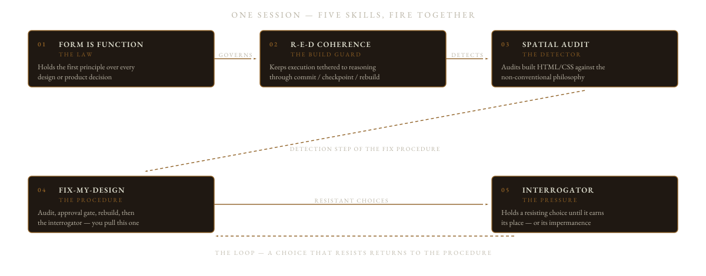

<p align="center">
  
</p>

<h1 align="center">Gregorian Mode</h1>

<p align="center">
  <a href="https://github.com/RichardLitt/standard-readme"></a>
  <a href="plugin.json"></a>
  <a href="LICENSE"></a>
</p>

<p align="center">
  <a href="#claude-code"></a>
  <a href="#hermes-agent"></a>
  <a href="#codex"></a>
  <a href="#cursor"></a>
  <a href="#github-copilot"></a>
</p>

<a name="tldr" id="tldr"></a>
##  01 · Overview

Gregorian Mode is a plugin that holds one design standard over everything an AI agent builds. It does not run as code — it is written instruction, plain text an agent reads and follows — so the same plugin moves to a different agent with nothing to compile, nothing to install alongside it, and nothing it depends on to work. It refuses to let design and function be separated, and it refuses to let a familiar shape pass just because it has been decorated. Five skills carry that standard — the law, the build guard, the detector, the fix procedure, the interrogator — and each carries its own activation trigger, so an agent loads a skill by itself the moment a session touches what it governs. The fix procedure is the one you ask for by name.

https://github.com/user-attachments/assets/b00c065b-b119-49e3-acbe-891ca90595c8

*The 109-second showcase — the two failure patterns, the five skills, and the fix procedure in motion. Also in this project: <a href="docs/assets/gregorian-mode-showcase.mp4">MP4 (45 MB)</a> · <a href="docs/assets/showcase-poster.jpg">poster frame</a>.*

### How the five skills fire together

<p align="center">
  
</p>

## Table of Contents

| | Chapter | What is in the room |
|---|---|---|
|  | [01 · Overview](#tldr) | The plugin in one paragraph · the showcase video · how the five skills fire together |
|  | [02 · Security](#security) | What runs (nothing) · the two things to know before relying on it |
|  | [03 · Background](#background) | The two failure patterns · the spatial philosophy underneath |
|  | [04 · Install](#install) | Five headline agents · eight more paths · dependencies (none) |
|  | [05 · Usage](#usage) | What fires on its own · the one door you open yourself · the four steps of a run |
|  | [06 · Components](#components) | The nine markdown components and where each one lives |
|  | [07 · Philosophy](#philosophy) | The first principle · the interrogation · what failure, impermanence, and rollback mean |
|  | [08 · Colophon](#colophon) | Design notes on this document · icon inventory · maintainers · contributing · license |

<p align="center"></p>

<a name="security" id="security"></a>
##  02 · Security

> **The room is empty on purpose.** Nothing here executes. Gregorian Mode is markdown instructions, not code: `plugin.json` declares metadata only — what the plugin is called, what version it is, where its pieces sit — and all behavior comes from five skills that an agent loads from the paths declared in that file. The plugin makes no network calls, defines no hooks, and runs nothing.

Two things to know before relying on it:

| | The caution | What it means |
|---|---|---|
|  | **The approval gate is an instruction, not a lock.** | The audit and the fix procedure are told to show you what they found and change nothing until you say yes. That is an instruction the plugin obeys, not a guarantee the software enforces — read the findings yourself before you approve anything. |
|  | **The skills auto-fire.** | Every skill opens with a line describing when it applies; an agent reads that line and loads the skill whenever a session matches what it says — `form-is-function` comes in for any session touching a design or product decision. If you do not want that watchfulness in a session, disable the plugin rather than arguing with it mid-session. |

<p align="center"></p>

<a name="background" id="background"></a>
##  03 · Background

Gregorian Mode exists because two failure patterns keep producing bad software, and neither is a knowledge problem. The model usually reasons correctly — ask it to look at a screen and it will tell you, accurately, what is wrong with it. The failure happens after the reasoning: it writes the analysis, then calls that analysis overthinking, then builds something that contradicts every word of it.

| The failure pattern | What Gregorian Mode does about it |
|---|---|
| **The reasoning–execution collapse.** An agent generates correct, specific design analysis, then labels that reasoning "overthinking," rushes execution, and produces output that contradicts the analysis it just completed. Correct it, and it reasons correctly again — then repeats the collapse. This is documented in the research: the Berkeley/ETH paper *The Danger of Overthinking* (Cuadron et al., 2025) identifies it as the Reasoning-Action Dilemma across 4,018 recorded agent task runs ([arXiv:2502.08235](https://arxiv.org/abs/2502.08235)), and *Large Reasoning Models are not thinking straight* ([arXiv:2507.00711](https://arxiv.org/abs/2507.00711)) shows that models disregard correct solutions even when someone hands them one. | The `reasoning-execution-design-coherence` skill is built directly against that collapse. |
| **Conventional-pattern gravity.** This is the familiar shape the overview refused to let pass — what this document calls a *conventional pattern*. A `<div>` — a box in the code — given rounded corners, some space inside it, and a soft shadow under it, is a card even if it is named `surface`. Renaming is not redesigning. Left unopposed, agents reach for the nearest conventional pattern — the card, the tab strip, the modal window that drops over everything else, the badge pinned to a corner, the panel of filters — and a fresh coat of styling changes nothing. | The `spatial-audit` skill is the instrument set against that gravity: it recognises patterns by how they look and behave once drawn, not by what the code calls them, and it rejects any fix that swaps one conventional pattern for another. |

What the two patterns share is a way of thinking the plugin calls spatial: anything on screen should behave like a physical object in a room. How it looks should be doing useful work rather than decorating, nothing important should hide behind a click, and every element has to answer one question — would this exist in a physical version of this space?

<p align="center"></p>

<a name="install" id="install"></a>
##  04 · Install

No build step, no package manager, no runtime dependencies — nothing to compile, nothing to install alongside it, nothing it needs to run. The plugin is plain markdown that a compatible agent discovers on load. All skills live under `skills/`; the root `plugin.json` is an [Agent Plugins 1.0.0](https://agent-plugins.org/specification) manifest — a plain statement of what the plugin is and where its pieces sit — and that one file stays true whichever agent reads it.

**The five headline agents at a glance:**

| Agent | Install method | What ships | Verification |
|---|---|---|---|
| [**Claude Code**](#claude-code) | `claude --plugin-dir ./Gregorian-Mode` | All five skills, plus the slash command and the subagent — the helper agent the main one can hand a job to — under `com.anthropic.claude/` | Documented direct-load path — this repository (a project's folder of files, kept online so you can copy it to your machine) carries no `marketplace.json` (a published listing some agents use to find plugins), so `/plugin marketplace add` will not work |
| [**Hermes Agent**](#hermes-agent) | `hermes plugins install … --no-enable` → `enable` → `gateway restart` | The five portable skills, discovered from the manifest |  Verified against the live runtime: install, enable, and skill discovery all work with the repository as shipped |
| [**Codex**](#codex) | `codex plugin add ./Gregorian-Mode` (Codex 0.146.0 and newer) | The portable root [`plugin.json`](plugin.json) (recommended) or the [.codex-plugin/plugin.json](.codex-plugin/plugin.json) fallback | Documented in OpenAI's packaging documentation |
| [**Cursor**](#cursor) | Cursor Settings → Customize → Plugins, importing from the copy on your machine | The portable `skills/` directory plus the `commands/` and `agents/` written in Claude's format, via [.cursor-plugin/plugin.json](.cursor-plugin/plugin.json) | The manifest decides; Cursor reads commands and agents written in Claude's format where it understands them |
| [**GitHub Copilot**](#github-copilot) | VS Code: **Chat: Install Plugin From Source** → repository URL | Portable `skills/` + root `plugin.json` + [`com.github.copilot/`](com.github.copilot) components (interrogator agent, command wrapper) |  The VS Code path is the verified install; the command-line marketplace path would need a `marketplace.json` the repository does not ship |

Full instructions, one collapsible block per agent:

<a name="claude-code" id="claude-code"></a>
<details>
<summary><strong>Claude Code</strong> · <code>claude --plugin-dir ./Gregorian-Mode</code></summary>

Requires [Claude Code](https://claude.com/claude-code).

```bash
git clone https://github.com/AlastairZeved/Gregorian-Mode.git
claude --plugin-dir ./Gregorian-Mode
```

The first line copies the plugin down onto your machine; the second loads that copy. The `--plugin-dir` flag loads the plugin directly without marketplace installation, and also accepts a `.zip` archive of the plugin directory. There is no `marketplace.json` in this repository, so `/plugin marketplace add AlastairZeved/Gregorian-Mode` will not work; `--plugin-dir` is the documented direct-load path. The command and the subagent that Claude Code loads live in that client's own folder, `com.anthropic.claude/` — the plugin calls these per-client folders namespaces.

</details>

<a name="hermes-agent" id="hermes-agent"></a>
<details>
<summary><strong>Hermes Agent</strong> · <code>hermes plugins install … --no-enable</code></summary>

```bash
hermes plugins install AlastairZeved/Gregorian-Mode --no-enable
hermes plugins enable gregorian-mode
hermes gateway restart
```

Portable Agent Plugins packages install disabled by default; enable explicitly and restart the gateway — the service that runs the agent — for the skills to take effect. (Verified against the live runtime: the install, enable, and skill discovery all work with the repository as shipped.)

</details>

<a name="codex" id="codex"></a>
<details>
<summary><strong>Codex</strong> · <code>codex plugin add ./Gregorian-Mode</code></summary>

Requires OpenAI Codex. Two paths, both shipped:

- **Portable (recommended).** The root [`plugin.json`](plugin.json) declares the Agent Plugins schema, and Codex reads its OpenAI-specific presentation data from `extensions["com.openai"]` (display name "Gregorian Mode", category "design").
- **Compatibility fallback.** The [.codex-plugin/plugin.json](.codex-plugin/plugin.json) manifest, which OpenAI documents as a supported fallback for existing `.codex-plugin/` packages.

```bash
git clone https://github.com/AlastairZeved/Gregorian-Mode.git
codex plugin add ./Gregorian-Mode
```

`plugin add` is the Codex CLI subcommand — the command you type in a terminal — for local directories (Codex 0.146.0 and newer use `plugin add`, not `plugin install`). The interrogator subagent stays in the Claude namespace. Codex describes its subagents in TOML — a different file format from the markdown the rest of the plugin is written in — and this repository ships none.

</details>

<a name="cursor" id="cursor"></a>
<details>
<summary><strong>Cursor</strong> · Settings → Customize → Plugins</summary>

Requires Cursor. The repository ships a [.cursor-plugin/plugin.json](.cursor-plugin/plugin.json) manifest pointing Cursor at the portable `skills/` directory and at the `commands/` and `agents/` written in Claude's format.

```bash
git clone https://github.com/AlastairZeved/Gregorian-Mode.git
```

Install from the repository: **Cursor Settings → Customize → Plugins** (or the Customize page), using an import from the copy on your machine. The manifest's `agents` and `commands` paths reference the `com.anthropic.claude/` client namespace; Cursor reads them where a Claude-style command or agent is understood.

</details>

<a name="github-copilot" id="github-copilot"></a>
<details>
<summary><strong>GitHub Copilot</strong> · VS Code "Install Plugin From Source"</summary>

Requires Copilot in VS Code, the Copilot CLI, or the app. Copilot supports Agent Plugins 1.0.0: it reads the portable `skills/` directory and the root `plugin.json`, then reads Copilot-specific components from the [`com.github.copilot/`](com.github.copilot) client namespace. This repository ships components in that namespace — the interrogator as an `.agent.md` custom agent and the fix procedure as a command wrapper — so Copilot users get the full plugin, not only the portable skills.

```bash
# VS Code: Chat: Install Plugin From Source (Command Palette), then enter the repo URL
https://github.com/AlastairZeved/Gregorian-Mode
```

In the Copilot CLI, install from a marketplace: `copilot plugin marketplace add AlastairZeved/Gregorian-Mode` followed by `copilot plugin install gregorian-mode@AlastairZeved/Gregorian-Mode` (the repository needs a `marketplace.json` to be configured as a CLI marketplace; without one, the VS Code "Install Plugin From Source" path above is the verified install). Support for agent plugins can be toggled with the `chat.plugins.enabled` VS Code setting. Skills appear in the **Configure Skills** menu; the interrogator agent appears alongside custom agents.

</details>

**More agents, plus the universal path:**

<details>
<summary><strong>Pi Agent</strong> · clone into <code>~/.pi/agent/</code></summary>

Pi Agent discovers skills in its config directory. Clone the repository there and the portable `skills/` directory is found automatically — no manifest needed.

```bash
git clone https://github.com/AlastairZeved/Gregorian-Mode.git ~/.pi/agent/
```

</details>

<details>
<summary><strong>Cline</strong> · copy <code>skills/</code> to <code>~/.cline/skills/</code></summary>

```bash
git clone https://github.com/AlastairZeved/Gregorian-Mode.git
mkdir -p ~/.cline/skills
cp -r Gregorian-Mode/skills/* ~/.cline/skills/
```

</details>

<details>
<summary><strong>Gemini CLI</strong> · <code>.gemini/skills/</code> or <code>~/.gemini/skills/</code></summary>

Install per-project or globally:

```bash
# Per-project
git clone https://github.com/AlastairZeved/Gregorian-Mode.git
mkdir -p .gemini/skills
cp -r Gregorian-Mode/skills/* .gemini/skills/

# Global
mkdir -p ~/.gemini/skills
git clone https://github.com/AlastairZeved/Gregorian-Mode.git ~/.gemini/skills/Gregorian-Mode
```

</details>

<details>
<summary><strong>Windsurf</strong> · <code>.windsurf/skills/</code> or <code>~/.windsurf/skills/</code></summary>

Install per-project or globally:

```bash
# Per-project
git clone https://github.com/AlastairZeved/Gregorian-Mode.git
mkdir -p .windsurf/skills
cp -r Gregorian-Mode/skills/* .windsurf/skills/

# Global
mkdir -p ~/.windsurf/skills
git clone https://github.com/AlastairZeved/Gregorian-Mode.git ~/.windsurf/skills/Gregorian-Mode
```

</details>

<details>
<summary><strong>OpenCode</strong> · native SKILL.md discovery</summary>

OpenCode already knows how to read skills — a small folder holding one markdown file, which is all a Gregorian Mode skill is. Per its [skills documentation](https://opencode.ai/docs/skills/), it discovers skills in project and global locations — including Claude-compatible paths — and searches upward from the folder you are working in (the working directory) to the top of the copied project (the git worktree). Clone the plugin and copy the skill folders into a discovered location:

```bash
git clone https://github.com/AlastairZeved/Gregorian-Mode.git
mkdir -p .opencode/skills
cp -r Gregorian-Mode/skills/* .opencode/skills/
```

Global alternative: `~/.config/opencode/skills/`. Claude-compatible paths (`.claude/skills/`, `~/.claude/skills/`) work without copying.

</details>

<details>
<summary><strong>Aider</strong> · <code>npx openskills install</code> + <code>sync</code></summary>

[Aider](https://aider.chat) reads `AGENTS.md` rather than SKILL.md files. [openskills](https://github.com/numman-ali/openskills) syncs SKILL.md-format skills into an `AGENTS.md`-compatible section (verified subcommands):

```bash
npx openskills install https://github.com/AlastairZeved/Gregorian-Mode
npx openskills sync          # regenerates AGENTS.md with the skills
```

Use `npx openskills list` to confirm the five skills installed, and `npx openskills read form-is-function` to load one into context.

</details>

<details>
<summary><strong>OpenClaw</strong> · <code>openclaw plugins install git:github.com/…</code></summary>

OpenClaw installs bundles — a plugin's files packaged together — straight from git, the tool that tracks a project's files and copies them between machines. The standard-format detection picks this repository up as an Agent Plugins (or Codex-marker) bundle and maps the portable `skills/` automatically:

```bash
openclaw plugins install git:github.com/AlastairZeved/Gregorian-Mode
openclaw plugins list        # verify: shows Format: bundle
openclaw gateway restart     # mapped skills load in the next session
```

Two OpenClaw-specific notes, verified against its bundle documentation:

- **Detection precedence.** OpenClaw checks `.codex-plugin/` before the root `plugin.json`, so this repository is detected as a *Codex* bundle rather than an *Agent* bundle. The practical impact is nil — Codex bundles map `skills/` identically — but `openclaw plugins inspect <id>` will report the Codex format.
- **The `ai.openclaw` namespace is reserved, not consumed.** OpenClaw reads `extensions["ai.openclaw"]` from the root manifest (currently only an `activation` setting) and ignores reverse-domain client *directories* — folders named like `com.anthropic.claude/` — so no such directory belongs in this repository. If the plugin ever needs OpenClaw-specific metadata, it goes under `extensions["ai.openclaw"]` in [`plugin.json`](plugin.json).

</details>

<details>
<summary><strong>Any other SKILL.md-compatible agent</strong> · copy a skill folder</summary>

Copy any folder under `skills/` into the agent's skills directory. Each skill is one self-contained markdown file with a short header at the top — YAML frontmatter, the `name`, `license`, and `description` lines an agent reads — and nothing else is required.

</details>

### Dependencies

None. Markdown only.

<p align="center"></p>

<a name="usage" id="usage"></a>
##  05 · Usage

The skills ask nothing of you — that is the point. `form-is-function` and `reasoning-execution-design-coherence` fire on their own the moment a session matches what they cover, and `spatial-audit` runs when work is being reviewed or presented. You never invoke those three directly.

The one thing you do invoke is the fix procedure. In Claude Code it is the slash command; in any other agent, ask for the same outcome in words:

```
/fix-my-design settings.html
```

or: *"Run fix-my-design on `settings.html`."*

What you point it at is any design, component, or file you want fixed. A run then proceeds:

1. **Detect.** The procedure runs `spatial-audit` on the target: every element is judged on five counts — the conventional pattern it leans on, how it behaves as a thing in a space, whether its looks are doing useful work, whether it holds its place while other things move, and how its content is framed — and findings come back ranked by how badly each one fails, each with a fix proposal.
2. **Present and wait.** Findings and proposals are shown. Nothing changes yet — the audit's approval gate holds inside the procedure.
3. **Rebuild, don't patch.** Once you approve, each fix goes back to the last point that still held up and rebuilds from there. Adding styling is never the fix; if the audit's own list of patterns to avoid would catch the proposed fix, it is still conventional and gets redesigned.
4. **Escalate resistant choices.** Where the conventional answer is strong and the better answer is not obvious, the procedure invokes the `interrogator` — as a subagent where your agent can hand work to a helper (Claude Code's Task tool, Hermes Agent's `delegate_task`), inside the same conversation otherwise.

The output returns the reworked design plus a rationale for every change: which conventional pattern was rejected, and what the new form communicates that text alone could not.

<p align="center"></p>

<a name="components" id="components"></a>
##  06 · Components

Nine markdown components. The five skills travel to any agent that understands a skill file; the command and the subagent ship twice — as Claude Code conveniences under `com.anthropic.claude/` and as Copilot components under `com.github.copilot/` — each pair wrapping the same two skills:

| Component | Type | Role |
|---|---|---|
| [`form-is-function`](skills/form-is-function/SKILL.md) | Skill (portable + auto-firing) | The law — holds every design or product decision to the first principle |
| [`reasoning-execution-design-coherence`](skills/reasoning-execution-design-coherence/SKILL.md) | Skill (portable + auto-firing) | The build guard — keeps the building tethered to the reasoning: commit a point, check it, rebuild from there |
| [`spatial-audit`](skills/spatial-audit/SKILL.md) | Skill (portable + auto-firing) | The detector — reads the page as built, its markup and its styling, and audits it against the philosophy rather than against convention |
| [`fix-my-design`](skills/fix-my-design/SKILL.md) | Skill (portable) | The fix procedure — the one you invoke by hand: audit → approval → rebuild → interrogator |
| [`interrogator`](skills/interrogator/SKILL.md) | Skill (portable) | The pressure — the interrogation brought to bear on a choice that resists |
| [`/fix-my-design`](com.anthropic.claude/commands/fix-my-design.md) | Slash command (Claude Code) | Thin wrapper: loads and follows the `fix-my-design` skill |
| [`interrogator`](com.anthropic.claude/agents/interrogator.md) | Subagent (Claude Code) | The pressure — the interrogation brought to bear on a choice that resists |
| [`fix-my-design`](com.github.copilot/commands/fix-my-design.command.md) | Command (Copilot) | Thin wrapper: loads and follows the `fix-my-design` skill |
| [`interrogator`](com.github.copilot/agents/interrogator.agent.md) | Custom agent (Copilot) | The pressure — the interrogation brought to bear on a choice that resists |

Each skill opens with a description of when it applies, and that line is its trigger: agents read those descriptions and load the skill when the session matches, with no manual invocation. The fix procedure is the only door you open by hand.

<p align="center"></p>

<a name="philosophy" id="philosophy"></a>
##  07 · Philosophy

| Room | What hangs in it |
|---|---|
| **The first principle** | Design and function are not two categories to balance or trade off against each other. They are one set of questions applied to any object, component, or decision until its value holds up on both counts at once — or until it honestly earns the right to be temporary as a working model, something good enough to use now. This is not a preference; it is the condition that holds before the work starts, and it governs before any conversation begins. A choice that came from how something looks is held to the exact same standard as a choice that came from what it does: a green button that is green because the other buttons are green has failed, and a component placed because an action needed a home has failed, and neither failure is more acceptable than the other. |
| **The interrogation** | This is the interrogation: every choice — however small, obvious, or conventional it looks — is run through eight questions before it is committed: 1. What is this thing, fully? 2. What has been used as this thing? 3. What could it be? 4. Does its design optimize or add value to its use? 5. Does its function borrow anything from its form? 6. What would be surprising or genuinely valuable here? 7. What does this choice connect to at every scale — the module it sits in, the app around it, the project beyond that? 8. Can it tie to something already in progress? |
| **Failure conditions** | A choice has failed the interrogation if it was made because the choices beside it were the same, because convention suggested it, because one side was satisfied and the other was never checked, because a pattern needed completing, because something needed to go somewhere, or because nobody asked whether it should last. Failure conditions are named directly, not softened. |
| **Impermanence** | Every choice is editable, and being finished is not the same as being permanent. A working model earns its place by being useful long enough for a better answer to surface — the whiteboard doesn't fail when it's replaced, it succeeded by lasting exactly as long as it needed to. No choice is protected from re-interrogation by citing the effort that went into it. |
| **Rollback, not patch** | When output collapses — execution betraying the reasoning that preceded it — the correct action is to roll back to the last verified-coherent position and rebuild. You cannot reason with poisoned context — once bad output sits in the conversation, it pulls the next answer down with it. Patching collapsed output produces more collapse. |
| **No tradeoff** | A choice that satisfies form but not function, or function but not form, has not finished the interrogation. |

<p align="center"></p>

<a name="colophon" id="colophon"></a>
##  08 · Colophon

### The design of this document

This README practices the rule it documents: a section is a room, not a paragraph. Every chapter carries a number and an icon from one family; the icon set, the textured ground each chapter sits on, and the ornaments in this page are documented in [docs/icons.md](docs/icons.md).

| Element | The rule it follows |
|---|---|
| **Section ground** | Backgrounds are not flat. Each chapter sits on the *ruled-manuscript ground* (documented in [docs/icons.md](docs/icons.md)): deep ink field, ruled baselines, a faint grid for the oversized opening letters, thin gold chapter frame. |
| **Icon family** | One family of drawn line icons — each one built on the same 24-unit grid, with a 2-unit stroke and rounded ends — replaces every emoji and decorative glyph on the page. |
| **Structural breaks** | No section runs past six consecutive prose lines: tables, highlighted notes, the system map, and icon-led lists break the walls. |
| **Wayfinding** | Finding your place: numbered chapters (01–08) plus the icon in every heading let a reader landing mid-page orient in seconds. |

### Maintainers

[@AlastairZeved](https://github.com/AlastairZeved)

### Contributing

Problems, questions, and proposed changes are welcome on [GitHub Issues](https://github.com/AlastairZeved/Gregorian-Mode/issues) — that is also the place to ask how the skills or the fix procedure behave in a given agent.

The contribution requirements follow from what the plugin is:

- **Markdown only.** The plugin works by instruction, not by running anything; do not add executable code, hooks, or build steps. `plugin.json` carries metadata, nothing more.
- **Descriptions are triggers.** A new skill, command, or agent is only as good as the `description` in its YAML frontmatter, the short header at the top of the file, because that is what agents read to decide when to load it. Write descriptions that name their triggers concretely.
- **Respect the packaging split.** Portable components (skills) live at the root; client-specific conveniences live in that client's own folder (`com.anthropic.claude/`, `com.github.copilot/`, …) or its adapter manifest — the file that adapts the plugin to that one client (`.codex-plugin/`, `.cursor-plugin/`). A new portable component goes under `skills/`; a client wrapper for it goes in that client's folder.
- **Keep the four manifests in sync.** A version bump or a description change has to be applied to all four of the files that declare it; they are separate contracts with separate readers. A missed one drifts silently — `manifest-sync` (tooling for this repository, deliberately distinct from the plugin's markdown-only rule) fails the automated check when any tracked `plugin.json` disagrees on `name` or `version`.
- **The standard applies to the plugin's own output.** Changes to the skills, command, or agent should survive the same interrogation they enforce — name what conventional documentation pattern you are rejecting and what the change adds.

### License

MIT © Alastair Zeved — see [LICENSE](LICENSE) for the full text.
